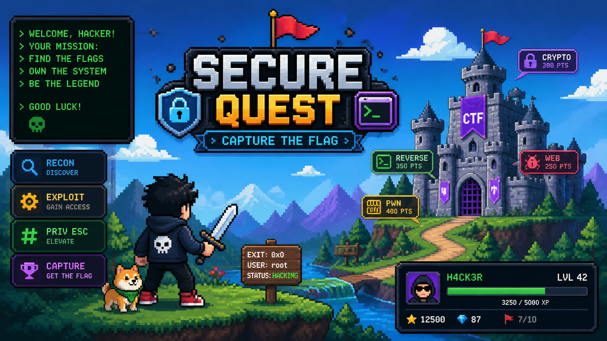

# SolarisFortress CTF Platform

A minimal but fully functional Capture The Flag (CTF) platform built for small
school CTFs and workshops. Administrators create challenges through the Django
admin; participants register, download challenge files, submit flags, and earn
points. A live leaderboard ranks participants by total score.

> **Stack:** Django + Django REST Framework · PostgreSQL (SQLite dev fallback) ·
> React + Vite · Session + Token authentication.

---

## Table of contents

1. [Features](#features)
2. [Project structure](#project-structure)
3. [Requirements](#requirements)
4. [Environment configuration](#environment-configuration)
5. [PostgreSQL setup (optional)](#postgresql-setup-optional)
6. [Backend — first run](#backend--first-run)
7. [Creating the admin account](#creating-the-admin-account)
8. [Seed data (sample challenges)](#seed-data-sample-challenges)
9. [Managing challenges via Django Admin](#managing-challenges-via-django-admin)
10. [Frontend — first run](#frontend--first-run)
11. [Production build (optional)](#production-build-optional)
12. [API reference](#api-reference)
13. [Data model](#data-model)
14. [Flag format](#flag-format)
15. [Security model](#security-model)
16. [Critical acceptance test](#critical-acceptance-test)
17. [Troubleshooting](#troubleshooting)
18. [Scope restrictions](#scope-restrictions)
19. [License](#license)

---

## Features

### Administrator (Django Admin)
- Create / edit / delete challenges
- Publish or unpublish challenges
- Set name, category, description, point value
- Set the correct flag (server-side only)
- Upload one or more challenge files (PNG, PDF, ZIP, PCAP, DOCX, XLSX, TXT, etc.)
- View all submissions and solves

### Participants (React frontend)
- Register / login / logout
- Browse available challenges
- View challenge details and download files
- Submit flags with instant feedback
- Earn points for the first correct submission per challenge
- See solved challenges and personal score
- See a live leaderboard ranked by score
- View profile with their stats

### Security
- The correct flag is **never** exposed via the API or the React frontend.
- Flags are validated server-side only.
- Submissions require authentication.
- A user can earn points only once per challenge (enforced by a unique
  `(user, challenge)` row on the `Solve` model).
- Challenge file downloads require authentication, and the file's challenge
  must be published.
- Only staff/superusers can manage challenges (via Django Admin).
- Points are computed server-side; the client cannot influence scores.
- Django's session auth + CSRF + permission system are used throughout.

---

## Project structure

```text
SolarisFortress_CTF-Platform/
├── backend/                  # Django project
│   ├── manage.py
│   ├── config/               # settings, urls, wsgi/asgi
│   │   ├── __init__.py
│   │   ├── settings.py
│   │   ├── urls.py
│   │   ├── wsgi.py
│   │   └── asgi.py
│   ├── challenges/           # main app
│   │   ├── __init__.py
│   │   ├── apps.py
│   │   ├── models.py
│   │   ├── admin.py
│   │   ├── serializers.py
│   │   ├── views.py
│   │   ├── urls.py
│   │   ├── migrations/
│   │   │   └── 0001_initial.py
│   │   └── management/
│   │       ├── __init__.py
│   │       └── commands/
│   │           ├── __init__.py
│   │           └── seed_demo.py
│   └── db.sqlite3            # dev DB (gitignored)
├── frontend/                 # React + Vite
│   ├── package.json
│   ├── vite.config.js
│   ├── index.html
│   └── src/
│       ├── main.jsx
│       ├── App.jsx
│       ├── api.js
│       ├── styles.css
│       ├── components/
│       │   ├── Navbar.jsx
│       │   └── ProtectedRoute.jsx
│       ├── pages/
│       │   ├── LoginPage.jsx
│       │   ├── RegisterPage.jsx
│       │   ├── DashboardPage.jsx
│       │   ├── ChallengesPage.jsx
│       │   ├── ChallengeDetailPage.jsx
│       │   ├── LeaderboardPage.jsx
│       │   └── ProfilePage.jsx
│       └── state/
│           └── AuthContext.jsx
├── media/                    # uploaded challenge files (gitignored)
├── .env.example
├── .gitignore
└── README.md
```

---

## Requirements

- **Python** 3.10+ (tested on 3.14)
- **Node.js** 18+ (tested on 24) and **npm**
- **PostgreSQL** 12+ (optional — SQLite is used as a dev fallback)
- A virtual environment tool (`venv`, `virtualenv`, etc.)

---

## Environment configuration

Copy the example env file and edit it:

```bash
cp .env.example .env
```

`.env` keys:

| Key                    | Description                                                        |
| ---------------------- | ------------------------------------------------------------------ |
| `DJANGO_SECRET_KEY`    | Long random string. **Required in production.**                    |
| `DJANGO_DEBUG`         | `True` or `False`.                                                 |
| `DJANGO_ALLOWED_HOSTS` | Comma-separated hosts (e.g. `localhost,127.0.0.1`).                |
| `FRONTEND_ORIGIN`      | Vite dev origin (default `http://localhost:5173`).                 |
| `USE_SQLITE`           | `1` to use SQLite (dev without PostgreSQL). `0` to use PostgreSQL. |
| `DB_NAME`              | PostgreSQL database name.                                          |
| `DB_USER`              | PostgreSQL user.                                                   |
| `DB_PASSWORD`          | PostgreSQL password.                                               |
| `DB_HOST`              | PostgreSQL host (default `127.0.0.1`).                             |
| `DB_PORT`              | PostgreSQL port (default `5432`).                                  |

> ⚠️ Never commit your real `.env`. Only `.env.example` is safe to share.

---

## PostgreSQL setup (optional)

If you have PostgreSQL installed locally:

```sql
CREATE DATABASE solarisfortress;
CREATE USER solaris WITH PASSWORD 'solaris';
GRANT ALL PRIVILEGES ON DATABASE solarisfortress TO solaris;
```

Then in `.env`, set:

```env
USE_SQLITE=0
DB_NAME=solarisfortress
DB_USER=solaris
DB_PASSWORD=solaris
DB_HOST=127.0.0.1
DB_PORT=5432
```

**Don't have PostgreSQL handy?** Leave `USE_SQLITE=1` and Django will create a
`backend/db.sqlite3` file automatically.

---

## Backend — first run

From the project root:

```bash
# Create and activate a virtualenv (skip if .venv already exists)
python -m venv .venv
# Windows
.venv\Scripts\activate
# macOS / Linux
source .venv/bin/activate

# Install Python dependencies
pip install django djangorestframework django-cors-headers \
            psycopg2-binary python-dotenv Pillow

# Apply database migrations
cd backend
python manage.py migrate
```

Then start the dev server:

```bash
python manage.py runserver
```

Visit:

- **Django Admin:**  http://127.0.0.1:8000/admin/
- **API root:**      http://127.0.0.1:8000/api/

---

## Creating the admin account

After `migrate`, create a Django superuser (administrator):

```bash
cd backend
python manage.py createsuperuser
```

You will be prompted for a username, email (optional), and password.

Example credentials used during initial development:

| Role   | Username   | Password     |
| ------ | ---------- | ------------ |
| Admin  | `admin`    | `admin123`   |
| Player | `conan0s4` | `Fl23xqtolo` |

> 🔐 Change these credentials before any real deployment.

---

## Seed data (sample challenges)

To insert five sample challenges for development/demo, run:

```bash
cd backend
python manage.py seed_demo
```

This inserts (if not already present):

| Name             | Category      | Points | Flag                                   |
| ---------------- | ------------- | -----: | -------------------------------------- |
| Hidden Evidence  | Forensics     |    100 | `solaris{hidden_in_plain_sight}`       |
| Simple Login     | Web           |    150 | `solaris{always_check_the_backdoor}`   |
| Caesar's Message | Cryptography  |     75 | `solaris{rotten_caesar_is_not_caesar}` |
| Lost File        | Miscellaneous |     50 | `solaris{lost_and_found}`              |
| Silent Image     | Steganography |    200 | `solaris{lsb_can_carry_a_secret}`      |

Re-running the command is safe — it only inserts missing challenges.

---

## Managing challenges via Django Admin

1. Log into `http://127.0.0.1:8000/admin/`.
2. Click **Challenges → Add challenge**.
3. Fill in:
   - **Name**
   - **Category** (Web, Forensics, Cryptography, Reverse Engineering, OSINT,
     Miscellaneous, Steganography)
   - **Points**
   - **Description** (multi-line text)
   - **Flag** (e.g. `solaris{hidden_in_plain_sight}`)
   - **Published** — must be checked for participants to see the challenge
   - *(Optional)* **Author** is auto-filled with the logged-in user on first save
4. In the **Challenge files** inline area, upload one or more files (PNG, PDF,
   ZIP, PCAP, DOCX, XLSX, TXT, etc.). Files are stored in
   `media/challenge_files/<challenge_id>/`.
5. Save.

The admin uses `list_display`, `list_filter`, `search_fields`, and `fieldsets`
so an organizer can manage the entire catalog without touching the database
directly.

To attach a file **after** a challenge is created, edit the challenge and use
the **Challenge files** inline at the bottom of the page.

---

## Frontend — first run

In a second terminal, from the project root:

```bash
cd frontend
npm install
npm run dev
```

The Vite dev server runs on **http://localhost:5173** and proxies:

- `/api/*` → `http://127.0.0.1:8000`
- `/media/*` → `http://127.0.0.1:8000`

This is configured in `frontend/vite.config.js`.

---

## Production build (optional)

```bash
cd frontend
npm run build
```

The static bundle is emitted into `frontend/dist/` and can be served by any
static host pointed at the Django backend's `FRONTEND_ORIGIN`. For the Django
side, run `python manage.py collectstatic` and serve `STATIC_ROOT` with your
reverse proxy.

---

## API reference

All endpoints are prefixed with `/api/`. Authentication uses Django sessions
(cookies) and a per-user token (`Authorization: Token <key>`). The React
frontend uses session auth by default and falls back to the token if present.

### Auth

| Method | Path                  | Description                              |
| ------ | --------------------- | ---------------------------------------- |
| POST   | `/api/auth/register/` | `{username, password, password_confirm}` |
| POST   | `/api/auth/login/`    | `{username, password}`                   |
| POST   | `/api/auth/logout/`   | Invalidates the current session.         |
| GET    | `/api/auth/me/`       | Current user + score.                    |

### Challenges

| Method | Path                                | Description                                      |
| ------ | ----------------------------------- | ------------------------------------------------ |
| GET    | `/api/challenges/`                  | List **published** challenges.                   |
| GET    | `/api/challenges/<id>/`             | Challenge detail. **Does not include the flag.** |
| GET    | `/api/challenges/<id>/files/<fid>/` | Download a challenge file (auth required).       |
| POST   | `/api/challenges/<id>/submit/`      | `{flag}` — validates and scores.                 |

### Other

| Method | Path                     | Description                                    |
| ------ | ------------------------ | ---------------------------------------------- |
| GET    | `/api/leaderboard/`      | Users ranked by total score, descending.       |
| GET    | `/api/progress/`         | Solved challenge IDs and total score for `me`. |
| GET    | `/api/submissions/mine/` | Last 100 submissions for the current user.     |

### Example: submit a flag

Request:

```http
POST /api/challenges/1/submit/
Content-Type: application/json
X-CSRFToken: <cookie-value>

{ "flag": "solaris{hidden_in_plain_sight}" }
```

Response (first correct submit):

```json
{
  "submission_id": 17,
  "is_correct": true,
  "already_solved": false,
  "awarded_points": 100,
  "total_score": 100,
  "challenge_id": 1,
  "solved": true
}
```

Response (re-submitting a flag for a challenge already solved):

```json
{
  "submission_id": 18,
  "is_correct": true,
  "already_solved": true,
  "awarded_points": 0,
  "total_score": 100,
  "challenge_id": 1,
  "solved": true
}
```

Response (incorrect flag):

```json
{
  "submission_id": 19,
  "is_correct": false,
  "already_solved": false,
  "awarded_points": 0,
  "total_score": 0,
  "challenge_id": 1,
  "solved": false
}
```

---

## Data model

```text
Challenge
  id, name, category, description, points,
  flag (server-side only), published,
  created_at, updated_at, author (FK User)

ChallengeFile
  id, challenge (FK), file, original_name, uploaded_at

Submission
  id, user (FK), challenge (FK), submitted_flag,
  is_correct, submitted_at

Solve
  id, user (FK), challenge (FK), solved_at
  UNIQUE (user, challenge)   ← prevents duplicate scoring
```

The `Solve` model's `unique_together = ("user", "challenge")` constraint
guarantees a user can only ever earn points once per challenge, even under
concurrent submissions.

---

## Flag format

All flags use the format `solaris{...}`, e.g. `solaris{hidden_in_plain_sight}`.
Validation is **strict equality** between the submitted string and the flag
configured in the admin — case-sensitive. The server trims leading/trailing
whitespace on the **submitted** flag only; the stored flag is compared
verbatim.

The flag value is never sent to the React frontend. The `ChallengeListSerializer`
and `ChallengeDetailSerializer` both omit the `flag` field, so opening browser
DevTools or hitting the API directly with a participant account will not reveal
any challenge's correct answer.

---

## Security model

| Concern                         | How it is handled                                                                          |
| ------------------------------- | ------------------------------------------------------------------------------------------ |
| Flag leaking through API        | Serializers do not include `flag`.                                                         |
| Flag leaking through admin      | Admin staff only; not exposed to participants.                                             |
| Unauthenticated submissions     | `IsAuthenticated` on the submit endpoint.                                                  |
| Duplicate scoring               | `Solve` row with `unique_together`.                                                        |
| Client-side point manipulation  | Points come from server; client only sees total.                                           |
| Privilege escalation            | Django auth + `is_staff` for admin.                                                        |
| CSRF on state-changing requests | `SessionAuthentication` + CSRF cookie.                                                     |
| File enumeration                | Files served only if the parent challenge is published and the requester is authenticated. |
| Direct file access              | Served through a Django view, not static media in production.                              |

> This project intentionally does not implement anti-replay, anti-automation,
> or rate-limiting. For a school CTF this is acceptable. For a larger
> competition, add a rate-limiter (e.g. `django-ratelimit`) and IP-based
> submission throttling.

---

## Critical acceptance test

This exact flow must pass before the platform is considered complete:

```text
Admin
  ↓
Django Admin
  ↓
Create challenge
  ↓
Set description
  ↓
Set points
  ↓
Set flag = solaris{test_flag}
  ↓
Upload challenge file
  ↓
Publish challenge
  ↓
Participant logs in
  ↓
Sees challenge
  ↓
Downloads file
  ↓
Submits wrong flag
  ↓
Receives incorrect response
  ↓
Submits solaris{test_flag}
  ↓
Receives correct response
  ↓
Points awarded
  ↓
Challenge marked solved
  ↓
Leaderboard updates
  ↓
Submit same correct flag again
  ↓
NO additional points awarded
```

Also verify by inspecting the frontend/API responses that the correct flag is
**not** present anywhere.

---

## Troubleshooting

- **`psycopg2` install fails on Windows** — make sure you have a C compiler
  available, or use `psycopg2-binary` (already in the install command) and
  use SQLite (`USE_SQLITE=1`).
- **CORS errors in the browser** — confirm `FRONTEND_ORIGIN` in `.env` matches
  the URL you opened (default `http://localhost:5173`).
- **CSRF errors on login/register** — the frontend automatically reads the
  `csrftoken` cookie. If you call the API with `curl`, first do a `GET` to
  obtain the cookie, then send it back via `-H "X-CSRFToken: <cookie-value>"`.
- **`400 Bad Request` on registration** — passwords must be at least 6
  characters and the username must be unique.
- **Challenge not showing up** — the **Published** checkbox must be ticked.
- **File upload not visible** — make sure you saved the challenge after
  uploading the file (the inline form needs an explicit save).
- **Static files in production** — run `python manage.py collectstatic` and
  serve `STATIC_ROOT` with your reverse proxy.

---

## Scope restrictions

This is intentionally a **mini CTF platform**. The following are **explicitly
out of scope**:

- Teams / team management
- Real-time multiplayer (WebSockets, chat, notifications)
- Email verification, password reset, OAuth, social login
- Advanced anti-cheat / anti-automation
- Dynamic flag generation
- Per-challenge Docker containers
- Custom challenge authoring language
- Complex hint systems
- Payments, analytics dashboards
- Custom role systems
- A separate React admin dashboard (Django Admin is used instead)
- AI, microservices, Kubernetes
- Docker (unless needed for PostgreSQL)

---

## License

MIT — for educational use at school CTFs and workshops.
